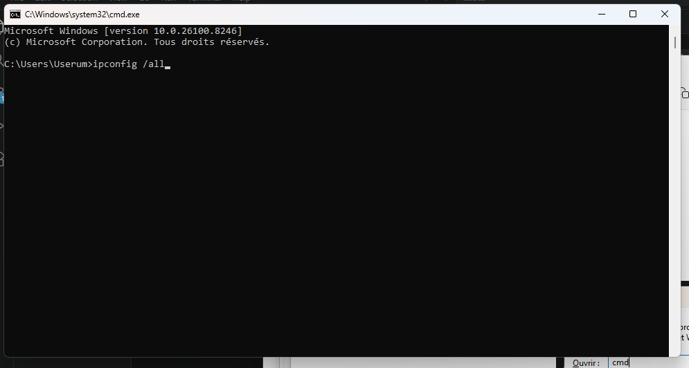
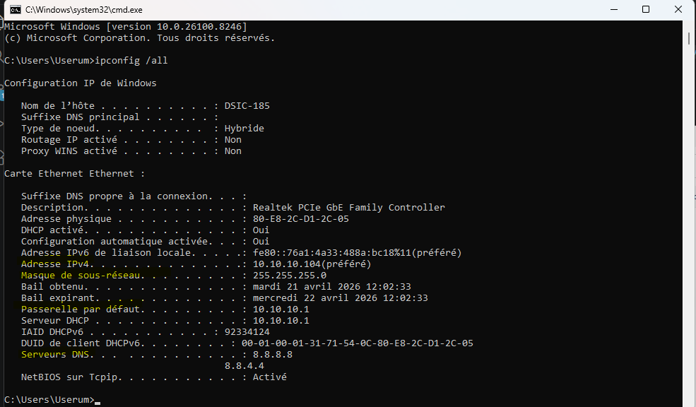
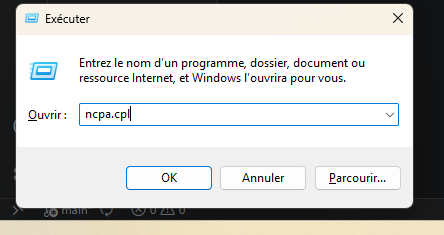
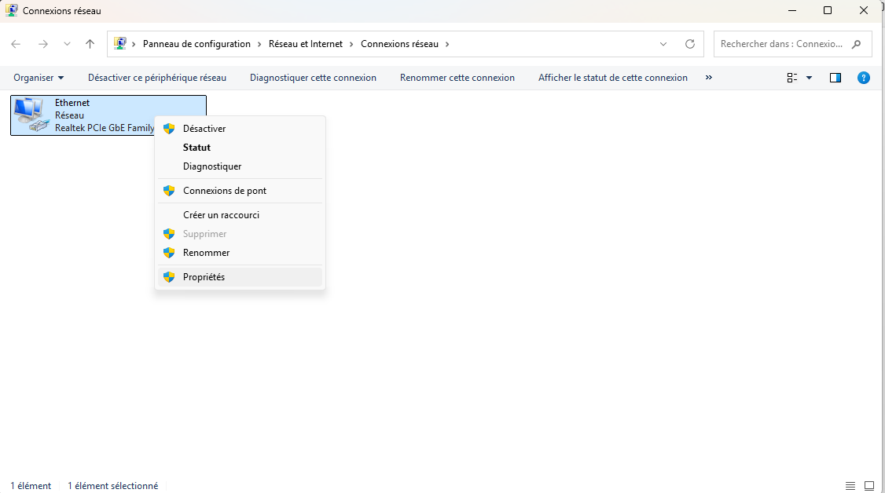
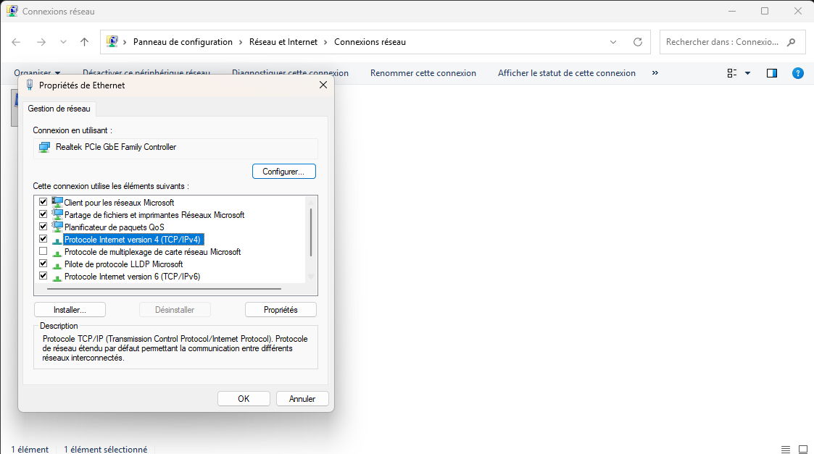
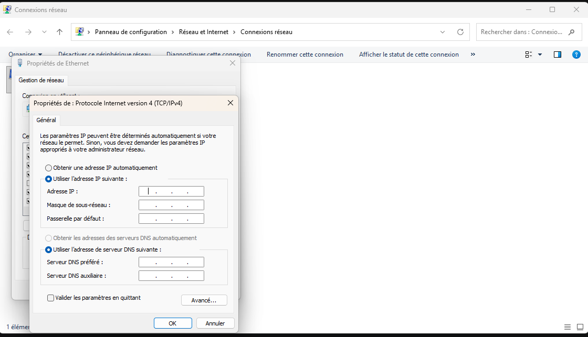

# Configurer statiquement une adresse IP
     First you have to retrieve the IP adresse,gateway,Submask, and DNS server adress
## Retrieving an IP adress,Gateway,DNS server and Subnet Mask

Type this command

Remember the numbers highlighted by yellow color. You'll need them in step 

    Then you have to go to network card panel

## Setting the IP adress statistically

1.

2.

3.

4. Fill in the cases with those numbers (from ipconfig)

validate and quit.
   
